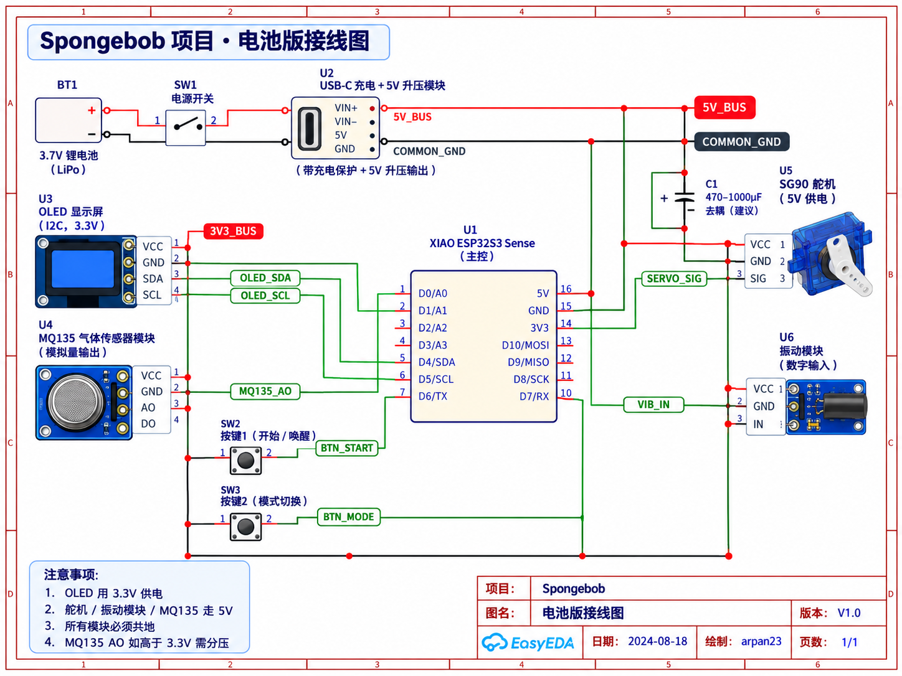

[Spongebob_README.md](https://github.com/user-attachments/files/32741435/Spongebob_README.md)# Spongebob

> 基于 XIAO ESP32S3 Sense 的空气状态感知 + 眼睑反馈 + OLED 信息显示 + 学习计时振动提醒装置。

本 README 直接整理了当前项目的**完整接线方案、电池供电方案、模块接口、面包板搭建顺序和立体海绵宝宝内部布局建议**。组员可以直接按本文档复刻原型。

---

## 1. 当前方案概述

本项目只使用 **1 块 XIAO ESP32S3 Sense** 作为主控，不额外增加单片机。

当前硬件包括：

- XIAO ESP32S3 Sense × 1
- MQ135 气体传感器模块 × 1
- SSD1306 I²C OLED × 1
- SG90 5V 微型舵机 × 1
- 5V 振动模块（建议购买带三极管 / MOSFET 驱动的成品模块）× 1
- 轻触按键 × 2
- 标准面包板 × 1
- 3.7V LiPo / 锂电池 × 1
- 电源开关 × 1
- USB-C 充电 + 5V 升压电源模块 × 1
- 杜邦线若干
- 470–1000 µF 电解电容 × 1（建议放在 SG90 附近）
- MQ135 分压电阻（如有需要）：10 kΩ + 20 kΩ

主要功能：

1. MQ135 读取空气状态 / CO₂ 相关变化趋势。
2. ESP32S3 根据空气状态控制 SG90。
3. SG90 通过机械连杆控制海绵宝宝眼睑开合。
4. OLED 显示空气状态、倒计时、待办事项等信息。
5. 学习计时结束后通过振动模块提醒。
6. 两个按键用于开始 / 暂停、模式切换 / 复位。

---

## 2. 电池版总体供电方案

当前推荐把整个系统设计成**单节 3.7V 锂电池供电**。

```text
3.7V LiPo 电池
      │
      ▼
   电源开关
      │
      ▼
USB-C 充电 + 5V 升压模块
      │
      ├──────── 5V_BUS ────────┬── XIAO ESP32S3 5V
      │                         ├── MQ135 VCC
      │                         ├── SG90 VCC
      │                         └── 振动模块 VCC
      │
      └──────── COMMON_GND ────┬── XIAO GND
                                ├── MQ135 GND
                                ├── SG90 GND
                                ├── 振动模块 GND
                                ├── OLED GND
                                ├── 按键 1 GND
                                └── 按键 2 GND

XIAO ESP32S3 3V3 ─────────────── OLED VCC
```

### 供电原则

- **OLED 使用 3.3V。**
- **MQ135 / SG90 / 振动模块使用 5V。**
- **所有模块必须共地。**
- ESP32S3 GPIO 只传输控制 / 采样信号，不直接给电机提供功率电流。
- 升压模块建议具备足够的瞬时输出能力，当前原型按 **5V / 2A 级别**规划更稳妥。

---

## 3. 电池版接线图

下图是当前电池版总体接线方案：



---

## 4. XIAO ESP32S3 引脚分配

| 功能 | 模块端口 | XIAO ESP32S3 | 类型 |
|---|---|---|---|
| MQ135 模拟采样 | AO | **D0 / GPIO1** | ADC 模拟输入 |
| SG90 舵机控制 | SIG | **D1 / GPIO2** | PWM / 舵机控制 |
| 振动模块控制 | IN / SIG | **D2 / GPIO3** | 数字输出 |
| OLED 数据 | SDA | **D4 / GPIO5** | I²C SDA |
| OLED 时钟 | SCL | **D5 / GPIO6** | I²C SCL |
| 按键 1 | 一端 | **D6 / GPIO43** | 数字输入 |
| 按键 2 | 一端 | **D7 / GPIO44** | 数字输入 |
| OLED 供电 | VCC | **3V3** | 3.3V 电源 |
| 系统地 | GND | **GND** | 公共地 |
| 主控供电 | 5V | **5V_BUS** | 5V 电源 |

程序中的推荐定义：

```cpp
const int PIN_MQ135 = D0;
const int PIN_SERVO = D1;
const int PIN_VIB   = D2;
const int PIN_SDA   = D4;
const int PIN_SCL   = D5;
const int BTN_START = D6;
const int BTN_MODE  = D7;
```

---

## 5. 各模块详细接线

### 5.1 MQ135 气体传感器

本项目只使用 MQ135 的 **AO 模拟输出**，DO 暂时不使用。

| MQ135 | 接到哪里 | 说明 |
|---|---|---|
| VCC | **5V_BUS** | 传感器加热与模块供电 |
| GND | **COMMON_GND** | 与 ESP32S3 共地 |
| AO | **D0 / GPIO1** | 模拟量输入 |
| DO | 不接 | 当前方案不用数字阈值输出 |

### MQ135 AO 分压保护

很多 MQ135 模块以 5V 供电时，AO 可能高于 ESP32S3 ADC 可接受的 3.3V。

如果无法确认 AO 已限制在 3.3V 以下，建议加入：

```text
MQ135 AO
   │
 10 kΩ
   │──────→ XIAO D0
 20 kΩ
   │
  GND
```

当 MQ135 AO = 5V 时，D0 约为 3.33V。

---

### 5.2 SSD1306 I²C OLED

| OLED | 接到哪里 |
|---|---|
| VCC | **XIAO 3V3** |
| GND | **COMMON_GND** |
| SDA | **D4 / GPIO5** |
| SCL | **D5 / GPIO6** |

建议 OLED 使用 3.3V 供电，使 SDA / SCL 上拉电平也保持在 3.3V。

---

### 5.3 SG90 舵机

| SG90 线色 | 接到哪里 | 作用 |
|---|---|---|
| 红线 | **5V_BUS** | 舵机供电 |
| 棕 / 黑线 | **COMMON_GND** | 公共地 |
| 橙 / 黄线 | **D1 / GPIO2** | 舵机控制信号 |

**不要把 SG90 红线接到 XIAO 的 3.3V 引脚。**

### SG90 去耦电容

建议在 SG90 附近的 5V 与 GND 之间加一个：

```text
470–1000 µF 电解电容
```

接法：

```text
5V_BUS ────────┬──────── SG90 VCC
               │
              +│
          470–1000µF
              -│
               │
GND ───────────┴──────── SG90 GND
```

作用：降低舵机启动瞬间造成的电压跌落，减少 ESP32S3 重启风险。

---

### 5.4 振动模块

推荐使用**带驱动的 5V 振动模块**。

| 振动模块 | 接到哪里 |
|---|---|
| VCC | **5V_BUS** |
| GND | **COMMON_GND** |
| IN / SIG | **D2 / GPIO3** |

如果使用裸振动电机，不应直接接 GPIO，需要额外使用三极管 / MOSFET 和续流二极管。

---

### 5.5 按键 1

用途：开始 / 暂停。

```text
D6 ─── 按键 ─── GND
```

程序建议：

```cpp
pinMode(BTN_START, INPUT_PULLUP);
```

按下时读取值由 HIGH 变 LOW。

---

### 5.6 按键 2

用途：模式切换 / 长按复位。

```text
D7 ─── 按键 ─── GND
```

程序建议：

```cpp
pinMode(BTN_MODE, INPUT_PULLUP);
```

---

## 6. 面包板推荐连接方式

面包板建议把两条长电源轨定义为：

```text
红色电源轨  → 5V_BUS
蓝 / 黑电源轨 → COMMON_GND
```

5V_BUS 连接：

```text
升压模块 5V OUT
   │
   ├── XIAO 5V
   ├── MQ135 VCC
   ├── SG90 VCC
   └── 振动模块 VCC
```

COMMON_GND 连接：

```text
升压模块 GND
   │
   ├── XIAO GND
   ├── MQ135 GND
   ├── SG90 GND
   ├── 振动模块 GND
   ├── OLED GND
   ├── 按键 1
   └── 按键 2
```

OLED 不走 5V 电源轨，而是：

```text
XIAO 3V3 → OLED VCC
```

---

## 7. 推荐实际搭建顺序

为了避免一次性接太多线后难以排错，建议严格按以下顺序：

1. **XIAO ESP32S3 单独上电**
   - 确认 Arduino IDE 能烧录。
   - 跑 Blink / 串口测试。

2. **OLED**
   - 接 3V3、GND、D4、D5。
   - 先跑 I²C Scanner。
   - 再测试显示 Hello。

3. **MQ135**
   - 接 5V、GND、AO→D0。
   - 串口观察 ADC 原始值。
   - 确认 D0 电压安全。

4. **SG90**
   - 接 D1、5V、GND。
   - 暂时不要连接机械眼睑。
   - 分别测试 0° / 30° / 60° / 90°。
   - 确认舵机动作时 ESP32 不重启。

5. **振动模块**
   - IN→D2。
   - 测试短震 0.3–0.5 秒。

6. **两个按键**
   - D6 / D7 分别接按键。
   - 检查按下时 HIGH → LOW。
   - 程序增加基础消抖。

7. **最后连接机械眼睑**
   - 安装眼球 / 眼睑。
   - 安装滑轨和连杆。
   - 限制舵机角度，防止机械卡死。

8. **最后接入电池系统**
   - 电池 → 开关 → 充电 / 升压模块。
   - 确认输出 5V 正常后再连接 5V_BUS。

---

## 8. 放入立体海绵宝宝内部的推荐布局

建议内部结构大致如下：

```text
               海绵宝宝顶部
        ┌────────────────────┐
        │      OLED 开窗      │
        │                    │
前脸 →  │  👁          👁    │
        │     眼睑 / 滑轨     │
        │          ╲         │
        │          SG90      │ ← 右侧壁
        │                    │
进气孔→ │ MQ135              │ ← 前下部
        │                    │
        │ XIAO + 面包板       │ ← 中下部
        │                    │
        │ 充电 + 5V 升压模块  │
        │                    │
        │ ███████████████    │
        │   3.7V LiPo 电池    │ ← 最底部
        └────────────────────┘
```

### 推荐位置

- **前脸：**眼球、眼睑、滑轨 / 连杆。
- **右侧壁：**SG90，尽量让连杆直线驱动眼睑。
- **前下部：**MQ135，靠近进气孔，不要完全密封。
- **中下部：**XIAO + 面包板，作为布线中心。
- **顶部 / 正面开窗：**OLED。
- **底部：**LiPo 电池，降低重心。
- **背部或底部：**两个按键，方便用户按压。
- **背壳附近：**电源开关、USB-C 充电口。

### 外壳必须预留

1. MQ135 进气孔。
2. OLED 显示窗口。
3. USB-C 充电孔。
4. 电源开关孔。
5. 两个按键孔。
6. 舵机与连杆运动空间。
7. 拆卸 / 维护后盖。

---

## 9. 功能对应关系

| 功能 | 硬件链路 | 说明 |
|---|---|---|
| 空气检测 | MQ135 → D0 | 周期采样，计算平均 / 等级 |
| 眼睑控制 | D1 → SG90 | 根据空气状态设置目标角度 |
| 信息显示 | D4 / D5 → OLED | CO₂ / 空气状态 / 待办 / 倒计时 |
| 学习计时 | ESP32S3 软件 | 不需要额外计时芯片 |
| 到时提醒 | D2 → 振动模块 | 短震 / 多次震动 |
| 开始 / 暂停 | D6 → 按键 1 | INPUT_PULLUP |
| 模式 / 复位 | D7 → 按键 2 | INPUT_PULLUP |

---

## 10. 上电前检查清单

- [ ] 电池正负极没有接反。
- [ ] 升压模块输出已经调到正确的 5V。
- [ ] 5V_BUS 和 3V3 没有短接。
- [ ] OLED VCC 接的是 3V3。
- [ ] MQ135 VCC 接的是 5V_BUS。
- [ ] SG90 红线接的是 5V_BUS。
- [ ] 振动模块 VCC 接的是 5V_BUS。
- [ ] 所有模块 GND 已经共地。
- [ ] MQ135 AO 没有直接把超过 3.3V 的信号送入 D0。
- [ ] SG90 附近已考虑 470–1000 µF 去耦电容。
- [ ] 裸振动电机没有直接接 GPIO。
- [ ] 第一次电子调试时尚未安装机械眼睑。
- [ ] 舵机角度已经限制，不会机械卡死。

---

## 11. USB 调试时的注意事项

如果 XIAO 同时连接电脑 USB-C，而系统又有独立的 5V 升压电源，**不要随意把两个独立 5V 电源硬并联**。

推荐调试阶段：

```text
电脑 USB-C → XIAO（程序烧录 / 调试）
电池升压 5V → MQ135 / SG90 / 振动模块
两边只共 GND + 信号线
```

在最终独立运行版本中，再统一使用电池电源系统。

---

## 12. 当前未最终确定的部分

以下项目仍可以根据实际采购和结构空间调整：

- 3.7V LiPo 电池具体容量。
- USB-C 充电 + 5V 升压模块具体型号。
- 海绵宝宝外壳尺寸。
- OLED 是 0.96 英寸还是 1.3 英寸。
- SG90 最终机械工作角度。
- MQ135 的具体校准方法与 ppm 换算方式。
- 是否把面包板原型后续改成洞洞板 / PCB。

只要 GPIO 分配发生变化，需要同步修改代码和本 README。

---

## 13. 当前接线速查

```text
MQ135 AO     → D0
SG90 SIG     → D1
Vibration IN → D2
OLED SDA     → D4
OLED SCL     → D5
Button 1     → D6 → Button → GND
Button 2     → D7 → Button → GND
OLED VCC     → 3V3
MQ135 VCC    → 5V_BUS
SG90 VCC     → 5V_BUS
Vibration VCC→ 5V_BUS
ALL GND      → COMMON_GND
```

---

**Project:** Spongebob  
**Current hardware version:** Battery prototype / V1.x  
**Target stage:** 面包板原型、课程展示、功能联调

