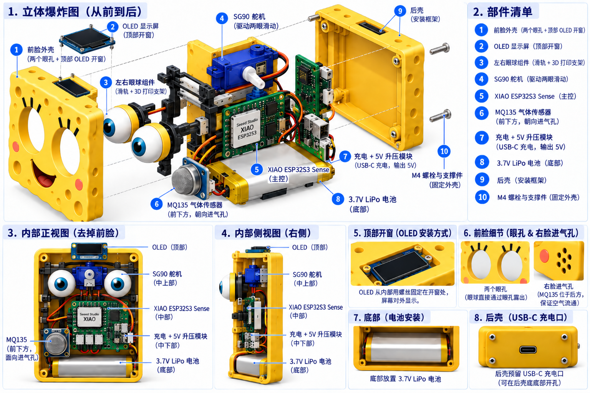
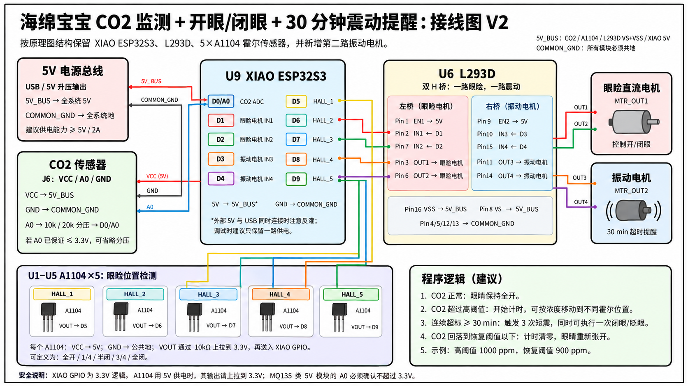

# Spongebob CO₂ Monitor

> 基于 **Seeed Studio XIAO ESP32S3 Sense** 的桌面空气状态提醒装置。  
> 当前版本舍弃 OLED 屏幕，保留海绵宝宝的 **开眼 / 闭眼机械反馈**，并新增 **CO₂ 持续超标 30 分钟后震动提醒**。



---

## 1. 当前版本的目标

当前版本只保留最核心的交互：

1. 读取 CO₂ / 空气状态传感器数据。
2. 根据空气状态控制眼睑机构开合。
3. 使用直流电机 + L293D 驱动眼睑机构。
4. 使用 5 个 A1104 霍尔传感器检测眼睑位置。
5. 当 CO₂ 连续超过设定阈值 **30 分钟**时，启动振动电机提醒。
6. 当空气恢复到正常范围时：
   - 停止提醒；
   - 清零超标计时；
   - 眼睛重新打开。

本版本不再使用：

- OLED 显示屏
- 显示屏支架
- 学习倒计时按键
- 与显示相关的结构件

---

## 2. 硬件组成

| 模块 | 数量 | 用途 |
|---|---:|---|
| XIAO ESP32S3 Sense | 1 | 主控 |
| CO₂ / 空气状态传感器 | 1 | 环境采样 |
| L293D | 1 | 双 H 桥驱动 |
| 眼睑直流电机 | 1 | 控制开眼 / 闭眼 |
| 小型振动电机 | 1 | 30 分钟超时提醒 |
| A1104 霍尔传感器 | 5 | 检测眼睑位置 |
| 10 kΩ 电阻 | 5 | A1104 输出上拉 |
| 10 kΩ + 20 kΩ 电阻 | 各 1 | CO₂ 模拟输出分压保护（如需要） |
| 5V 电源 / 3.7V 电池 + 5V 升压模块 | 1 | 系统供电 |
| 面包板 | 1 | 原型接线 |
| 磁铁 | 1～若干 | 随眼睑机构移动，触发霍尔传感器 |

---

## 3. 总体工作逻辑

```text
CO₂ 传感器
     │
     ▼
XIAO ESP32S3
     │
     ├──────────────→ 读取 5 个霍尔传感器
     │
     ├── D1 / D2 ──→ L293D 第一组 H 桥 ──→ 眼睑直流电机
     │
     └── D3 / D4 ──→ L293D 第二组 H 桥 ──→ 振动电机
```

建议状态逻辑：

```text
CO₂ 正常
   ↓
眼睛保持打开
   ↓
不震动

CO₂ 超过高阈值
   ↓
开始计时
   ↓
根据浓度控制眼睑位置
   ↓
连续超标达到 30 min ?
   ├─ 否 → 继续监测
   └─ 是 → 振动 3 次 + 可执行一次明显闭眼/眨眼

CO₂ 回落至恢复阈值以下
   ↓
停止提醒
   ↓
计时器清零
   ↓
眼睛重新打开
```

---

## 4. 接线图

> 这张接线图按照原始原理图的结构重新整理：  
> 保留 **XIAO ESP32S3 + L293D + 5×A1104 + CO₂ 传感器**，并利用 L293D 的第二组 H 桥增加振动电机。



---

## 5. XIAO ESP32S3 引脚分配

| 功能 | XIAO 引脚 | 连接对象 |
|---|---|---|
| CO₂ 模拟采样 | D0 / A0 | CO₂ 传感器 A0，经分压后输入 |
| 眼睑电机方向 1 | D1 | L293D Pin 2 / IN1 |
| 眼睑电机方向 2 | D2 | L293D Pin 7 / IN2 |
| 振动电机方向 1 | D3 | L293D Pin 10 / IN3 |
| 振动电机方向 2 | D4 | L293D Pin 15 / IN4 |
| 霍尔传感器 1 | D5 | HALL_1 VOUT |
| 霍尔传感器 2 | D6 | HALL_2 VOUT |
| 霍尔传感器 3 | D7 | HALL_3 VOUT |
| 霍尔传感器 4 | D8 | HALL_4 VOUT |
| 霍尔传感器 5 | D9 | HALL_5 VOUT |
| 备用 | D10 | 暂不使用 |
| 主控供电 | 5V | 5V_BUS |
| 公共地 | GND | COMMON_GND |
| 霍尔输出上拉 | 3V3 | 5×10 kΩ 上拉电阻 |

推荐代码定义：

```cpp
const int PIN_CO2 = D0;

const int EYE_IN1 = D1;
const int EYE_IN2 = D2;

const int VIB_IN3 = D3;
const int VIB_IN4 = D4;

const int HALL_1 = D5;
const int HALL_2 = D6;
const int HALL_3 = D7;
const int HALL_4 = D8;
const int HALL_5 = D9;
```

---

## 6. 5V 电源总线

整个原型只保留两条公共电源线：

```text
5V_BUS
COMMON_GND
```

连接关系：

```text
5V 电源 / 5V 升压模块
        │
        ├── XIAO ESP32S3 5V
        ├── CO₂ 传感器 VCC
        ├── L293D Pin 8  (VS)
        ├── L293D Pin 16 (VSS)
        ├── L293D Pin 1  (EN1)
        ├── L293D Pin 9  (EN2)
        └── 5 × A1104 VCC

COMMON_GND
        │
        ├── XIAO GND
        ├── CO₂ 传感器 GND
        ├── L293D Pin 4
        ├── L293D Pin 5
        ├── L293D Pin 12
        ├── L293D Pin 13
        └── 5 × A1104 GND
```

### 重要

如果 XIAO 同时连接电脑 USB-C 和外部 5V 供电，要避免 5V 反向灌电。  
原型调试阶段最简单的做法是：

- 调试烧录时使用 USB-C；
- 最终电池运行时使用外部 5V；
- 不要在没有隔离措施的情况下让两路 5V 同时接入。

---

## 7. CO₂ 传感器接线

按照原图中的三线接口：

```text
J6 CO2_SNSR

VCC ─────────→ 5V_BUS
GND ─────────→ COMMON_GND
A0  ─────────→ 分压电路 ─────────→ XIAO D0/A0
```

如果传感器 A0 可能达到 5V，使用：

```text
CO₂ A0
   │
  10 kΩ
   │
   ├────────→ XIAO D0/A0
   │
  20 kΩ
   │
  GND
```

当传感器输出为 5V 时，分压后约为 3.33V。

> 如果你实际使用的 CO₂ 模块已经明确保证 A0 最大不超过 3.3V，可以省略这一分压。

### MQ135 注意事项

如果当前使用的是 MQ135，它更适合作为空气质量 / 气体变化趋势传感器。  
若要在程序中显示或判断真正的 CO₂ ppm，需要进行校准；如果最终项目要求较准确的 ppm，建议后续换成专用 CO₂ 传感器。

---

## 8. L293D：眼睑电机接线

原图中的 `MTR_OUT` 继续作为眼睑电机输出。

### 第一组 H 桥

| L293D | 连接 |
|---|---|
| Pin 1 / EN1 | 5V_BUS |
| Pin 2 / IN1 | XIAO D1 |
| Pin 3 / OUT1 | 眼睑电机端子 1 |
| Pin 4 / GND | COMMON_GND |
| Pin 5 / GND | COMMON_GND |
| Pin 6 / OUT2 | 眼睑电机端子 2 |
| Pin 7 / IN2 | XIAO D2 |
| Pin 8 / VS | 5V_BUS |

控制逻辑：

| D1 | D2 | 眼睑电机 |
|---:|---:|---|
| LOW | LOW | 停止 |
| HIGH | LOW | 正转，例如闭眼 |
| LOW | HIGH | 反转，例如开眼 |
| HIGH | HIGH | 不建议作为正常运行状态 |

程序必须结合霍尔传感器进行限位，避免电机到位后继续堵转。

---

## 9. L293D：振动电机接线

L293D 的第二组 H 桥直接用于振动电机，因此不需要另外再增加一个 MOSFET 驱动板。

| L293D | 连接 |
|---|---|
| Pin 9 / EN2 | 5V_BUS |
| Pin 10 / IN3 | XIAO D3 |
| Pin 11 / OUT3 | 振动电机端子 1 |
| Pin 12 / GND | COMMON_GND |
| Pin 13 / GND | COMMON_GND |
| Pin 14 / OUT4 | 振动电机端子 2 |
| Pin 15 / IN4 | XIAO D4 |
| Pin 16 / VSS | 5V_BUS |

最简单的振动控制：

```cpp
void vibrationOn() {
  digitalWrite(VIB_IN3, HIGH);
  digitalWrite(VIB_IN4, LOW);
}

void vibrationOff() {
  digitalWrite(VIB_IN3, LOW);
  digitalWrite(VIB_IN4, LOW);
}
```

推荐提醒模式：

```text
震 0.5 s
停 0.5 s
震 0.5 s
停 0.5 s
震 0.5 s
停止
```

---

## 10. A1104 霍尔传感器接线

本版本保留原图中的 **5 个 A1104**。

每个 A1104 使用：

```text
A1104
Pin 1 VCC  ─────→ 5V_BUS
Pin 2 GND  ─────→ COMMON_GND
Pin 3 VOUT ─────→ 对应 XIAO GPIO
                   │
                  10 kΩ
                   │
                  3V3
```

即：

| 霍尔传感器 | 输出连接 |
|---|---|
| U1 / HALL_1 | D5 |
| U2 / HALL_2 | D6 |
| U3 / HALL_3 | D7 |
| U4 / HALL_4 | D8 |
| U5 / HALL_5 | D9 |

A1104 的供电电压不建议直接使用 3.3V，因此传感器本体使用 5V；  
输出端使用 10 kΩ 电阻上拉到 **XIAO 的 3.3V**，这样送入 GPIO 的高电平不会超过 3.3V。

程序建议：

```cpp
pinMode(HALL_1, INPUT);
pinMode(HALL_2, INPUT);
pinMode(HALL_3, INPUT);
pinMode(HALL_4, INPUT);
pinMode(HALL_5, INPUT);
```

---

## 11. 五个霍尔位置如何使用

为了让 5 个霍尔传感器真正有意义，可以沿眼睑运动方向布置成 5 个离散位置：

```text
HALL_1       HALL_2       HALL_3       HALL_4       HALL_5
全开          1/4闭         半闭          3/4闭         全闭
  │             │             │             │             │
  ●─────────────●─────────────●─────────────●─────────────●
                     眼睑 / 磁铁运动方向
```

这样可以实现：

- CO₂ 较低：移动到 HALL_1，完全张眼；
- CO₂ 开始升高：移动到 HALL_2；
- CO₂ 继续升高：移动到 HALL_3 / HALL_4；
- CO₂ 很高：移动到 HALL_5，明显闭眼。

如果后期发现只需要“开 / 闭”两个状态，可以只保留 HALL_1 和 HALL_5；  
但当前接线图先完整保留你原图中的 5 个霍尔传感器。

---

## 12. 30 分钟持续超标计时

程序不要使用：

```cpp
delay(30 * 60 * 1000);
```

否则 ESP32 在这 30 分钟里无法正常进行其他检测。

应该使用 `millis()`：

```cpp
const unsigned long HIGH_DURATION =
    30UL * 60UL * 1000UL;

const unsigned long ALERT_REPEAT =
    10UL * 60UL * 1000UL;

bool highCO2 = false;
unsigned long highStartTime = 0;
unsigned long lastAlertTime = 0;
```

示例状态逻辑：

```cpp
void updateCO2State(float co2) {

  const float HIGH_THRESHOLD  = 1000.0;
  const float RESET_THRESHOLD = 900.0;

  if (co2 >= HIGH_THRESHOLD) {

    if (!highCO2) {
      highCO2 = true;
      highStartTime = millis();
      lastAlertTime = 0;
    }

    unsigned long highTime = millis() - highStartTime;

    if (highTime >= HIGH_DURATION) {

      if (lastAlertTime == 0 ||
          millis() - lastAlertTime >= ALERT_REPEAT) {

        vibrateThreeTimes();

        // 可选：同时执行一次明显闭眼 / 眨眼动作
        // moveEyeToHall(5);

        lastAlertTime = millis();
      }
    }

  } else if (co2 <= RESET_THRESHOLD) {

    highCO2 = false;
    highStartTime = 0;
    lastAlertTime = 0;

    // 恢复全开
    // moveEyeToHall(1);
  }
}
```

上面 `1000 ppm / 900 ppm` 只是推荐示例。  
如果使用 MQ135 而没有完成 ppm 标定，应改为基于实际实验得到的 ADC 阈值。

---

## 13. 眼睑电机控制示例

```cpp
void eyeMotorStop() {
  digitalWrite(EYE_IN1, LOW);
  digitalWrite(EYE_IN2, LOW);
}

void eyeMotorClose() {
  digitalWrite(EYE_IN1, HIGH);
  digitalWrite(EYE_IN2, LOW);
}

void eyeMotorOpen() {
  digitalWrite(EYE_IN1, LOW);
  digitalWrite(EYE_IN2, HIGH);
}
```

到达目标霍尔位置后必须立即：

```cpp
eyeMotorStop();
```

不要只依靠固定延时控制眼睑，否则机械尺寸变化后容易出现：

- 电机堵转；
- 连杆受力过大；
- 眼睑卡死；
- L293D 发热；
- 供电电压下降。

---

## 14. 推荐程序状态机

推荐把程序分成 4 个状态：

```text
NORMAL
正常，眼睛全开

HIGH_CO2_TIMING
CO₂ 已超标，但不足 30 min

ALERT
连续超标 ≥ 30 min
震动提醒 + 眼睑动作

RECOVERY
CO₂ 已恢复
清空计时并打开眼睛
```

这样后续调试比大量 `if + delay()` 更容易。

---

## 15. 内部组件位置

取消 OLED 后，内部结构可以明显简化：

```text
正面
┌─────────────────────────┐
│       眼球 / 眼睑        │
│                          │
│   霍尔传感器 + 磁铁轨迹   │
│       眼睑直流电机        │
│                          │
│ CO₂传感器      面包板     │
│                XIAO      │
│                L293D     │
│                          │
│         电池 / 5V         │
│                          │
│         振动电机          │
└─────────────────────────┘
底部
```

推荐位置：

- **前上部：**眼球、眼睑、磁铁、霍尔传感器；
- **上部 / 侧面：**眼睑直流电机；
- **前下部靠进气孔：**CO₂ 传感器；
- **中部：**面包板 + XIAO ESP32S3 + L293D；
- **底部：**电池；
- **最底部或底板：**振动电机，让震动更容易传递到外壳和桌面。

---

## 16. 推荐搭建顺序

1. 单独测试 XIAO ESP32S3。
2. 接 CO₂ 传感器，先从串口读取数据。
3. 接 L293D 和眼睑电机，不连接机械连杆，先验证正转 / 反转 / 停止。
4. 逐个接入 5 个 A1104，使用磁铁靠近检查数字量变化。
5. 将磁铁安装到眼睑运动机构，调试 5 个霍尔位置。
6. 接振动电机，测试第二组 H 桥。
7. 加入 30 分钟计时逻辑；调试时先把 30 min 临时改成 10～30 s。
8. 最后恢复为真正的 30 min，并装入海绵宝宝外壳。

---

## 17. 上电前检查

- [ ] 5V_BUS 与 GND 没有短路。
- [ ] XIAO GPIO 没有直接连接 5V。
- [ ] CO₂ A0 输入 XIAO 前最大不超过 3.3V。
- [ ] 5 个 A1104 使用 5V 供电。
- [ ] 5 个 A1104 VOUT 均使用 10 kΩ 上拉到 3.3V。
- [ ] L293D Pin 4、5、12、13 全部接地。
- [ ] L293D Pin 8、16 接 5V。
- [ ] L293D Pin 1、9 已使能。
- [ ] 眼睑电机卡住时程序能及时停止。
- [ ] 振动电机不直接连接 XIAO GPIO。
- [ ] 所有模块共地。
- [ ] 调试时没有同时用两路 5V 向 XIAO 反向供电。

---

## 18. 当前版本一句话说明

> **海绵宝宝通过 CO₂ / 空气状态感知环境：空气变差时眼睛逐渐闭合；若高 CO₂ 状态连续持续 30 分钟，则通过震动提醒用户及时通风。**

---

## 19. 技术资料

- Seeed Studio XIAO ESP32S3 Series — 官方引脚与供电说明
- STMicroelectronics L293D — 双 H 桥电机驱动器数据手册
- Allegro A1101/A1102/A1103/A1104/A1106 — 霍尔开关数据手册

