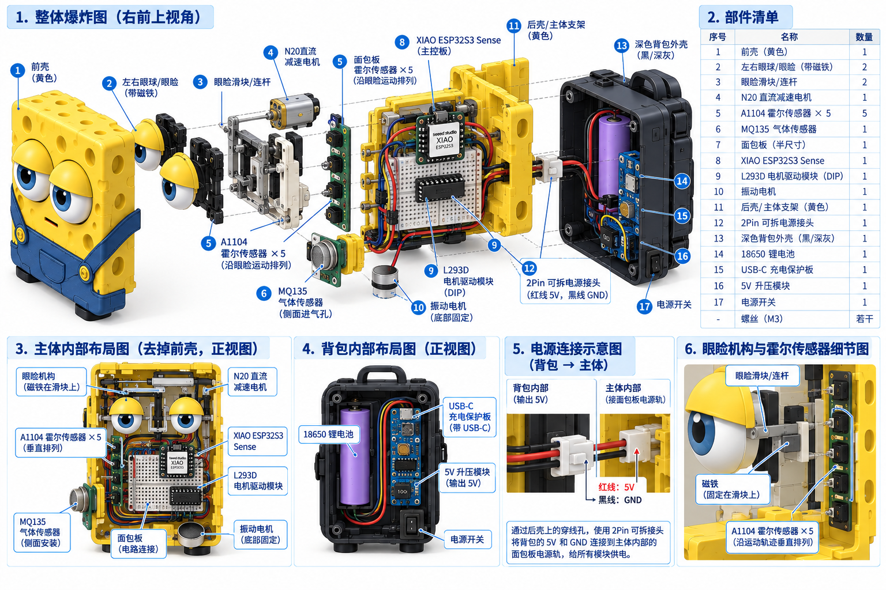
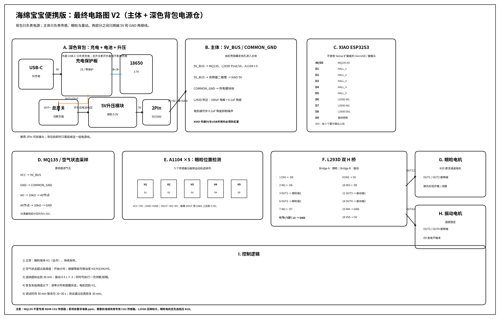

# Drowsy Sponge V2.0  
## 海绵造型 CO2 / 空气状态感知 + 眼睑反馈 + 30 分钟震动提醒装置

> **当前最终设计版本：便携式、无显示屏、无自制 PCB、主体使用面包板、背部采用深色“背包式电池仓”。**

本项目受到 Hackster 项目 **Spongebob That Can Detect Drowsiness** 的启发，并在原方案基础上重新整理机械结构、电源结构和交互逻辑。

参考项目：  
https://www.hackster.io/mondal3011/spongebob-that-can-detect-drowsiness-c610b4

---

# 1. 项目目标

我们希望制作一个约 **150 mm × 150 mm × 150 mm** 的黄色方形海绵造型桌面装置。

最终版本不再使用 OLED 屏幕，而是通过更直观的机械反馈提醒用户：

1. 实时采集室内空气状态；
2. 根据空气状态控制海绵角色的眼睑开合；
3. 使用 5 个霍尔传感器对眼睑位置进行反馈定位；
4. 当空气状态持续恶化并超过设定条件 **30 分钟**时：
   - 执行明显闭眼 / 眨眼动作；
   - 同时启动底部振动电机提醒；
5. 当环境恢复到正常范围：
   - 眼睑重新打开；
   - 超标计时清零；
   - 停止周期性提醒。

为了实现便携使用，设备后部增加一个深色背包：

- 内置 18650 锂电池；
- USB-C 充电保护模块；
- 5V 升压模块；
- 总电源开关。

**主体与背包之间只通过两根电源线连接：5V 和 GND。**

---

# 2. 最终外观定义

整体外形：

- 主体：黄色立方体；
- 正面：两只眼睛和可移动眼睑；
- 下半部分：蓝色背带裤造型；
- 后部：深色背包式电池仓；
- 底部：四个小脚垫；
- 侧面：MQ135 进气孔；
- 背包侧面：
  - USB-C 充电口；
  - 电源开关。

主体内部不放电池。

背包内部只放电源相关器件。

---

# 3. 最终机械解构图



图中需要重点理解以下关系：

## 3.1 主体部分

主体内部包括：

- 左右眼球；
- 左右眼睑；
- 眼睑滑块 / 连杆；
- N20 直流减速电机；
- 磁铁；
- A1104 霍尔传感器 ×5；
- MQ135；
- XIAO ESP32S3；
- 面包板；
- L293D；
- 振动电机；
- 主体内部支架。

## 3.2 背包部分

背包内部包括：

- 18650 锂电池；
- USB-C 充电保护模块；
- 5V 升压模块；
- 总电源开关；
- 2Pin 主体供电接头。

## 3.3 主体和背包的电气连接

主体和背包之间 **不传输传感器信号**。

只传输：

```text
红线：5V
黑线：GND
```

连接关系：

```text
背包
│
├── 18650
├── 充电保护板
├── 总电源开关
└── 5V升压
      │
      ├── 5V
      └── GND
           │
           ▼
        2Pin接头
           │
       穿过后壳
           │
           ▼
主体面包板电源母线
```

推荐使用：

```text
JST-XH 2Pin
```

或者其他有锁扣的 2Pin 插头。

这样拆除背包时：

1. 拧下背包固定螺丝；
2. 拔掉 2Pin 电源插头；
3. 背包即可单独拆下。

---

# 4. 最终电路图



矢量版本：

```text
spongebob_circuit_final.svg
```

---

# 5. 系统总体架构

```text
                         ┌────────────────────┐
                         │    深色背包电源仓   │
                         │                    │
USB-C ──> 充电保护板 ──> 18650                │
                         │                    │
                         └────────┬───────────┘
                                  │
                              总电源开关
                                  │
                              5V升压模块
                                  │
                              5V + GND
                                  │
                              2Pin连接器
                                  │
══════════════════════════════════╪══════════════════
                                  │
                         ┌────────▼───────────┐
                         │    黄色主体内部     │
                         │                    │
                         │      面包板         │
                         │        │           │
                         │        ├─ XIAO     │
                         │        ├─ MQ135    │
                         │        ├─ L293D    │
                         │        └─ Hall×5   │
                         │                    │
                         │ L293D ──> 眼睑电机 │
                         │ L293D ──> 振动电机 │
                         └────────────────────┘
```

---

# 6. 为什么使用面包板而不是自制 PCB

当前版本 **不制作自定义 PCB**。

我们使用：

- 一块半尺寸面包板；
- XIAO ESP32S3；
- DIP 封装 L293D；
- 电阻；
- 杜邦线；
- 2Pin 接头。

优点：

1. 成本低；
2. 接线容易修改；
3. 适合课程项目；
4. 调试方便；
5. 后续如果引脚调整，不需要重新打板；
6. SolidWorks 中只需要设计一个简单的电子托板。

因此项目图中如果出现类似“大块绿色自制 PCB”，都不是当前版本。

---

# 7. BOM：主体部分

| 编号 | 元件 | 数量 | 建议 |
|---|---|---:|---|
| 1 | XIAO ESP32S3 / ESP32S3 Sense | 1 | 主控 |
| 2 | 半尺寸面包板 | 1 | 约 82.5 × 55 mm |
| 3 | MQ135 模块 | 1 | 空气状态检测 |
| 4 | L293D DIP16 | 1 | 双 H 桥驱动 |
| 5 | N20 直流减速电机 | 1 | 低速型 |
| 6 | A1104 霍尔传感器 | 5 | 眼睑位置反馈 |
| 7 | 小型磁铁 | 1 | 固定在滑块 / 连杆 |
| 8 | 振动电机 | 1 | 3–5V |
| 9 | 10kΩ 电阻 | 6 | 5个霍尔上拉 + MQ135分压 |
| 10 | 20kΩ 电阻 | 1 | MQ135分压 |
| 11 | 肖特基二极管 | 1 | 推荐 SS14 等 |
| 12 | 100uF 电解电容 | 1 | L293D 附近 |
| 13 | 0.1uF 陶瓷电容 | 2–4 | 去耦 / 抑制电机噪声 |
| 14 | JST-XH 2Pin | 1 对 | 主体 / 背包电源连接 |
| 15 | 杜邦线 | 若干 | 原型接线 |

---

# 8. BOM：背包电源部分

| 编号 | 元件 | 数量 | 建议 |
|---|---|---:|---|
| 1 | 18650 锂电池 | 1 | 建议正规品牌 |
| 2 | USB-C 1S 锂电充电保护板 | 1 | 必须带保护功能 |
| 3 | 5V 升压模块 | 1 | 连续输出建议 ≥1A |
| 4 | 总电源开关 | 1 | 小拨动 / 船型 |
| 5 | 2Pin 电源输出插座 | 1 | 与主体匹配 |
| 6 | 电池固定座 | 1 | 18650 电池槽 |
| 7 | 背包盖板 | 1 | 可拆卸 |
| 8 | M3 螺丝 | 若干 | 背包与主体固定 |

建议不要购买来源不明的裸锂电池。

---

# 9. 背包电源接线

建议采用：

```text
USB-C
  │
  ▼
1S充电保护板
  │
  ├───────────────┐
  │               │
 B+              B-
  │               │
  └────18650──────┘
  │
 OUT+
  │
 总电源开关
  │
  ▼
5V升压模块
  │
  ├── OUT+ = 5V
  └── OUT- = GND
          │
          ▼
      JST 2Pin
          │
          ▼
       主体内部
```

### 为什么开关放在升压模块前

推荐：

```text
保护板 OUT+ → 开关 → 升压模块
```

这样关机后：

- 升压模块也被断电；
- 减少静态耗电；
- 设备仍然可以通过 USB-C 给电池充电。

---

# 10. 主体 5V 电源母线

从背包进入主体：

```text
5V
GND
```

接入面包板：

```text
面包板红色电源轨  = 5V_BUS
面包板蓝色电源轨  = COMMON_GND
```

5V_BUS 分配到：

```text
MQ135 VCC
L293D Pin 8  VS
L293D Pin 16 VSS
A1104 ×5 VCC
XIAO 5V（通过肖特基二极管）
```

GND 分配到：

```text
MQ135 GND
XIAO GND
L293D Pin 4
L293D Pin 5
L293D Pin 12
L293D Pin 13
A1104 ×5 GND
```

---

# 11. XIAO 外部 5V 供电注意事项

Seeed Studio 官方说明：

XIAO ESP32S3 的 5V 引脚可以作为外部电源输入，但外部电源和 5V 引脚之间应加入二极管，以避免与 USB 电源产生反向供电风险。

因此推荐：

```text
5V_BUS
  │
肖特基二极管
  │
  ▼
XIAO 5V
```

推荐使用低压降肖特基二极管。

调试时：

- USB-C 可用于给 XIAO 烧录程序；
- 背包外部 5V 最好关闭；
- 或保证电源隔离设计正确。

---

# 12. XIAO ESP32S3 引脚分配

本项目建议沿用原 Hackster 项目的主要引脚逻辑。

| 功能 | XIAO |
|---|---|
| MQ135 模拟输入 | A0 / D0 |
| 霍尔 1 | D1 |
| 霍尔 2 | D2 |
| 霍尔 3 | D3 |
| 霍尔 4 | D4 |
| 霍尔 5 | D5 |
| 眼睑电机 IN1 | D6 |
| 眼睑电机 IN2 | D7 |
| 眼睑电机 Enable | D8 |
| 振动电机控制 | D9 |

D10、D11、D12 暂时保留。

> 如果使用 XIAO ESP32S3 Sense 扩展板的 microSD 功能，需要注意 D8/D9/D10 与 microSD 的 SPI 引脚存在复用。本项目不使用摄像头和 microSD，因此建议只使用 XIAO 主板作为控制器。

Arduino 定义：

```cpp
const int PIN_MQ135 = A0;

const int HALL_1 = D1;
const int HALL_2 = D2;
const int HALL_3 = D3;
const int HALL_4 = D4;
const int HALL_5 = D5;

const int EYE_IN1 = D6;
const int EYE_IN2 = D7;
const int EYE_EN  = D8;

const int VIB_CTRL = D9;
```

---

# 13. MQ135 接线

```text
MQ135 VCC → 5V_BUS
MQ135 GND → COMMON_GND
MQ135 AO  → 分压 → XIAO A0
```

如果 MQ135 模块模拟输出最大可能接近 5V：

```text
MQ135 AO
   │
  10kΩ
   │
   ├──────── XIAO A0
   │
  20kΩ
   │
  GND
```

计算：

```text
Vout = Vin × 20 / (10 + 20)
```

当：

```text
Vin = 5V
```

得到：

```text
Vout ≈ 3.33V
```

避免向 ESP32 ADC 输入过高电压。

---

# 14. 关于 MQ135 和 “CO2 ppm”

必须明确：

**MQ135 并不是专用 CO2 NDIR 传感器。**

它对多种气体都有响应。

因此：

- 如果只是做课程演示，可以把它作为“空气状态 / CO2 趋势”传感器；
- 如果要报告准确的 CO2 ppm：
  - 必须做较严格校准；
  - 或换成专用 CO2 传感器，例如 SCD40 / SCD41 等。

当前机械方案无需因为换传感器而大改。

---

# 15. A1104 霍尔传感器接线

A1104 建议使用 5V 供电。

每个传感器：

```text
A1104
Pin 1 VCC  → 5V
Pin 2 GND  → GND
Pin 3 VOUT → XIAO GPIO
```

输出需要上拉。

为了保护 XIAO 的 3.3V GPIO：

```text
XIAO 3V3
   │
 10kΩ
   │
   ├──── A1104 VOUT
   │
   └──── XIAO D1 / D2 / D3 / D4 / D5
```

不要把 VOUT 上拉到 5V 后直接接 ESP32。

---

# 16. 五个霍尔传感器的机械位置

五个霍尔传感器 **不能放在面包板旁边**。

它们必须安装在：

> 眼睑磁铁的运动轨迹旁。

建议定义：

```text
H1        H2        H3        H4        H5

●---------●---------●---------●---------●
全开      轻闭      半闭      很困      全闭

              ↑
           磁铁运动
```

磁铁安装在：

- 眼睑滑块；
- 或眼睑连杆。

眼睑电机转动时：

```text
N20
 ↓
曲柄 / 连杆
 ↓
眼睑滑块
 ↓
磁铁移动
 ↓
依次触发 H1 ~ H5
```

这样程序可以知道真实机械位置。

---

# 17. L293D 接线

L293D DIP16。

## 第一组 H 桥：眼睑电机

| L293D | 连接 |
|---|---|
| Pin 1 EN1 | XIAO D8 |
| Pin 2 IN1 | XIAO D6 |
| Pin 3 OUT1 | N20 端子 1 |
| Pin 4 | GND |
| Pin 5 | GND |
| Pin 6 OUT2 | N20 端子 2 |
| Pin 7 IN2 | XIAO D7 |
| Pin 8 VS | 5V_BUS |

Pin 16：

```text
VSS → 5V_BUS
```

---

# 18. 眼睑电机控制

示例：

```cpp
void eyeStop() {
  digitalWrite(EYE_IN1, LOW);
  digitalWrite(EYE_IN2, LOW);
}

void eyeForward() {
  digitalWrite(EYE_IN1, HIGH);
  digitalWrite(EYE_IN2, LOW);
}

void eyeReverse() {
  digitalWrite(EYE_IN1, LOW);
  digitalWrite(EYE_IN2, HIGH);
}
```

D8：

```cpp
digitalWrite(EYE_EN, HIGH);
```

也可以使用 PWM：

```cpp
analogWrite(EYE_EN, pwmValue);
```

用于降低眼睑移动速度。

---

# 19. 为什么需要霍尔传感器

如果只按照时间控制：

```text
电机转 0.8 秒
```

机械误差会导致：

- 眼睑位置漂移；
- 连杆卡住；
- 电机堵转；
- 电机发热；
- L293D 发热。

使用霍尔定位：

```text
启动电机
  ↓
不断读取 Hall
  ↓
检测到目标 Hall
  ↓
立即停止
```

因此机械系统是闭环的。

---

# 20. L293D 第二组 H 桥：振动电机

为了减少元件数量，我们直接使用 L293D 的第二组 H 桥驱动振动电机。

连接：

| L293D | 连接 |
|---|---|
| Pin 9 EN2 | 5V |
| Pin 10 IN3 | XIAO D9 |
| Pin 11 OUT3 | 振动电机端 1 |
| Pin 12 | GND |
| Pin 13 | GND |
| Pin 14 OUT4 | 振动电机端 2 |
| Pin 15 IN4 | GND |
| Pin 16 VSS | 5V |

因此：

```text
D9 = LOW
振动停止

D9 = HIGH
振动启动
```

代码：

```cpp
void vibrationOn() {
  digitalWrite(VIB_CTRL, HIGH);
}

void vibrationOff() {
  digitalWrite(VIB_CTRL, LOW);
}
```

---

# 21. L293D 的压降问题

L293D 是老式双极型 H 桥。

它的输出压降明显大于现代 MOSFET 电机驱动。

因此 5V 供电时：

```text
电机实际得到的电压可能明显低于 5V
```

这也是我们建议使用：

```text
低压 N20 直流减速电机
```

的原因。

如果后期发现：

- 眼睑推力不足；
- 运行速度太慢；

可以把 L293D 换成更低压降的现代电机驱动模块。

软件和机械设计基本不用改变。

---

# 22. 去耦与电机抗干扰

电机启动时可能造成 ESP32 重启。

建议在 L293D 5V 电源附近：

```text
5V ─── 100uF ─── GND
5V ─── 0.1uF ─── GND
```

N20 电机两端：

```text
Motor+
   │
 0.1uF
   │
Motor-
```

振动电机也可以增加类似电容。

布线时：

- 电机线尽量短；
- 传感器模拟线与电机线分开；
- 所有 GND 共地；
- 5V 和 GND 使用较粗导线连接背包和主体。

---

# 23. 电源能力建议

因为系统同时包括：

- MQ135 加热器；
- ESP32；
- N20 电机；
- 振动电机；
- L293D；
- 5 个霍尔传感器；

升压模块不能只看“ESP32功耗”。

推荐：

```text
5V 输出连续能力 ≥ 1A
```

更保险：

```text
选择标称 5V / 2A 的升压方案
```

但必须检查模块真实持续输出能力和温升。

---

# 24. 软件状态机

推荐状态：

```text
NORMAL
正常状态

HIGH_AIR_TIMING
空气状态异常，开始计时

ALERT
连续异常达到30分钟

RECOVERY
恢复正常
```

---

# 25. 30 分钟计时逻辑

不要：

```cpp
delay(30 * 60 * 1000);
```

必须使用：

```cpp
millis()
```

定义：

```cpp
const unsigned long HIGH_DURATION =
  30UL * 60UL * 1000UL;

const unsigned long ALERT_REPEAT =
  10UL * 60UL * 1000UL;

bool highAir = false;

unsigned long highStartTime = 0;
unsigned long lastAlertTime = 0;
```

---

# 26. 推荐核心逻辑

```cpp
void updateAirState(float value) {

  const float HIGH_THRESHOLD  = 1000;
  const float RESET_THRESHOLD = 900;

  if (value >= HIGH_THRESHOLD) {

    if (!highAir) {
      highAir = true;
      highStartTime = millis();
      lastAlertTime = 0;
    }

    unsigned long elapsed =
      millis() - highStartTime;

    if (elapsed >= HIGH_DURATION) {

      if (lastAlertTime == 0 ||
          millis() - lastAlertTime >= ALERT_REPEAT) {

        vibrateThreeTimes();

        // 可以同时执行一次闭眼 / 眨眼
        moveEyeToHall(5);

        lastAlertTime = millis();
      }
    }

  } else if (value <= RESET_THRESHOLD) {

    highAir = false;
    highStartTime = 0;
    lastAlertTime = 0;

    moveEyeToHall(1);
  }
}
```

---

# 27. 眼睑位置控制框架

```cpp
int hallPins[5] = {
  HALL_1,
  HALL_2,
  HALL_3,
  HALL_4,
  HALL_5
};
```

检测当前霍尔：

```cpp
int getCurrentHall() {

  for (int i = 0; i < 5; i++) {

    if (digitalRead(hallPins[i]) == LOW) {
      return i + 1;
    }
  }

  return 0;
}
```

移动：

```cpp
void moveEyeToHall(int target) {

  int current = getCurrentHall();

  if (current == target) {
    eyeStop();
    return;
  }

  if (current == 0) {
    // 上电初始化时应先寻找一个已知端点
  }

  if (target > current) {
    eyeForward();
  } else {
    eyeReverse();
  }

  unsigned long start = millis();

  while (millis() - start < 3000) {

    if (getCurrentHall() == target) {
      eyeStop();
      return;
    }
  }

  // 安全超时
  eyeStop();
}
```

必须加入安全超时。

避免霍尔传感器损坏时电机一直堵转。

---

# 28. 三次震动函数

```cpp
void vibrateThreeTimes() {

  for (int i = 0; i < 3; i++) {

    vibrationOn();
    delay(500);

    vibrationOff();

    if (i < 2) {
      delay(500);
    }
  }
}
```

一次提醒：

```text
震 0.5s
停 0.5s
震 0.5s
停 0.5s
震 0.5s
```

---

# 29. 建议眼睑等级

如果希望保留原项目“空气越差、眼睛越困”的视觉效果：

```text
Hall 1
正常 / 全开

Hall 2
轻微闭眼

Hall 3
半闭

Hall 4
明显困倦

Hall 5
接近全闭
```

注意：

这些等级最好在实际测量数据稳定之后再确定。

---

# 30. 主体内部布局

正视剖面推荐：

```text
┌──────────────────────────┐
│       N20 + 连杆          │
│                          │
│   眼睑        眼睑        │
│                          │
│ Hall×5 / 磁铁轨迹         │
│                          │
│ MQ135      XIAO           │
│            + 面包板       │
│            + L293D        │
│                          │
│       振动电机            │
└──────────────────────────┘
```

---

# 31. 各部件位置原则

## MQ135

位置：

```text
主体侧面
```

原因：

- 直接接触外部空气；
- 远离电机；
- 远离密闭角落。

外壳需要设置进气孔。

---

## 面包板

位置：

```text
主体中下部
```

安装：

- 面包板背胶固定到电子托板；
- 托板通过 4 个 M3 螺丝固定到主体支架。

---

## XIAO + L293D

都安装在面包板上。

避免增加额外支架。

---

## 振动电机

位置：

```text
主体底部
```

原因：

```text
振动电机
  ↓
主体底板
  ↓
脚垫 / 桌面
```

能够产生更明显的触觉 / 桌面振动。

---

# 32. 背包机械设计

推荐背包大约：

```text
宽 70~90 mm
高 80~100 mm
厚 25~35 mm
```

根据电池实际尺寸调整。

背包包含：

```text
背包主体
背包盖板
18650 固定槽
充电板固定柱
升压板固定柱
USB-C 开孔
电源开关开孔
2Pin 走线孔
```

---

# 33. 背包与主体的机械连接

推荐使用：

```text
左右两条连接耳
+
M3 螺丝
```

每侧至少：

```text
2 颗 M3
```

总共：

```text
4 颗 M3
```

使背包受力不会全部集中在塑料薄壁上。

---

# 34. 背包与主体的电气连接

在后壳与背包重叠区域设计：

```text
Ø6~8 mm 隐藏走线孔
```

两根线：

```text
5V
GND
```

从孔中通过。

孔外看不到。

内部接：

```text
JST-XH 2P
```

或者类似可拆插头。

---

# 35. SolidWorks 零件划分建议

建议自己建模的零件：

```text
01_front_shell.SLDPRT
02_rear_shell.SLDPRT
03_main_frame.SLDPRT
04_electronics_tray.SLDPRT
05_eye_slider_left.SLDPRT
06_eye_slider_right.SLDPRT
07_motor_bracket.SLDPRT
08_hall_sensor_strip.SLDPRT
09_mq135_bracket.SLDPRT
10_vibration_motor_holder.SLDPRT
11_backpack_shell.SLDPRT
12_backpack_cover.SLDPRT
13_battery_holder.SLDPRT
```

标准件：

```text
XIAO ESP32S3
Breadboard
L293D
MQ135
N20 motor
A1104 ×5
18650
Charging module
5V boost module
Switch
Fasteners
```

---

# 36. 最终装配体树

```text
Drowsy_Sponge.SLDASM
│
├─ Body
│  ├─ Front Shell
│  ├─ Rear Shell
│  ├─ Main Frame
│  ├─ Electronics Tray
│  ├─ Breadboard
│  ├─ XIAO ESP32S3
│  ├─ L293D
│  ├─ MQ135
│  ├─ Eye Mechanism
│  │  ├─ N20 Motor
│  │  ├─ Linkage
│  │  ├─ Left Eyelid
│  │  ├─ Right Eyelid
│  │  ├─ Magnet
│  │  └─ A1104 ×5
│  └─ Vibration Motor
│
└─ Backpack
   ├─ Backpack Shell
   ├─ Backpack Cover
   ├─ 18650
   ├─ Charging Protection Module
   ├─ Power Switch
   ├─ 5V Boost Module
   └─ 2Pin Connector
```

---

# 37. 推荐调试顺序

## 第 1 步：电源

不要一开始就接所有模块。

先测试：

```text
18650
→ 充电板
→ 开关
→ 升压
→ 5.0V
```

万用表确认：

```text
4.9~5.1V
```

---

## 第 2 步：XIAO

只接：

```text
5V
GND
```

确认正常启动。

---

## 第 3 步：MQ135

串口打印：

```text
analogRead(A0)
```

观察数据变化。

---

## 第 4 步：霍尔

逐个测试：

```text
H1
H2
H3
H4
H5
```

磁铁靠近时 GPIO 应切换。

---

## 第 5 步：L293D + N20

先不要接眼睑。

测试：

```text
正转
停止
反转
停止
```

---

## 第 6 步：机械连杆

连接眼睑。

低速运行。

逐个标定 Hall 位置。

---

## 第 7 步：振动电机

测试：

```text
D9 HIGH
```

确认电机震动。

---

## 第 8 步：30 分钟逻辑

调试时改成：

```cpp
30 seconds
```

全部稳定后改回：

```text
30 minutes
```

---

# 38. 上电前检查表

- [ ] 背包升压输出已调为 5.0V
- [ ] 5V 与 GND 不短路
- [ ] 18650 极性正确
- [ ] 充电模块支持保护
- [ ] 电源开关位于充电保护板与升压负载之间
- [ ] XIAO 5V 外部供电有防反灌措施
- [ ] MQ135 A0 最大值不超过 3.3V
- [ ] 五个 A1104 VOUT 均上拉到 3.3V
- [ ] A1104 VCC 为 5V
- [ ] L293D Pin 4/5/12/13 均接 GND
- [ ] L293D Pin 8/16 接 5V
- [ ] N20 没有机械卡死
- [ ] 程序存在电机动作超时保护
- [ ] 振动电机不直接接 XIAO GPIO
- [ ] 主体与背包之间只有 5V/GND
- [ ] 两根主体供电线规格足够
- [ ] USB 充电时电池不过热

---

# 39. 项目设计理念

最终版本的交互并不是：

> 给用户显示很多数字。

而是：

```text
空气变差
   ↓
海绵角色越来越困
   ↓
眼睑逐渐闭合
   ↓
长期处于异常空气状态
   ↓
30分钟后振动提醒
   ↓
提醒用户通风
```

这是整个项目最重要的表达。

---

# 40. 文件结构建议

```text
Spongebob/
│
├─ README.md
│
├─ images/
│  ├─ spongebob_effect_drawing.png
│  ├─ spongebob_exploded_final.png
│  └─ spongebob_circuit_final.png
│
├─ hardware/
│  ├─ solidworks/
│  └─ wiring/
│
├─ firmware/
│  └─ main.ino
│
└─ docs/
   └─ BOM.md
```

如果直接放在仓库根目录，也可以使用当前 README 中的相对路径。

---

# 41. 技术参考

## Seeed Studio XIAO ESP32S3

https://wiki.seeedstudio.com/xiao_esp32s3_getting_started/

官方说明包括：

- D0~D12 引脚映射；
- 5V 输入；
- 3V3 输出；
- Sense 版本引脚复用。

---

## L293D

STMicroelectronics：

https://www.st.com/en/motor-drivers/l293d.html

L293D 支持：

- 四路推挽驱动；
- 可组合为两个 H 桥；
- 内置续流二极管；
- 600mA / channel 级输出能力。

---

## Allegro A1104

https://www.allegromicro.com/en/products/sense/switches-and-latches/switches/a1101-2-3-4-6

A1104：

- 连续时间霍尔开关；
- 适合位置检测；
- 供电范围覆盖 5V；
- 输出使用上拉。

---

# 42. 当前版本总结

最终设计可以概括成：

> **一个穿蓝色背带裤、背深色电池背包的黄色立方体海绵造型便携空气状态提醒器。主体通过 MQ135 感知空气状态，由 XIAO ESP32S3 控制 N20 电机驱动眼睑，5 个 A1104 霍尔传感器反馈真实眼睑位置。当异常空气状态持续 30 分钟后，底部振动电机触发提醒。电池、充电、升压和总开关全部集中在独立背包中，背包和主体只通过 5V/GND 两根线连接。**
